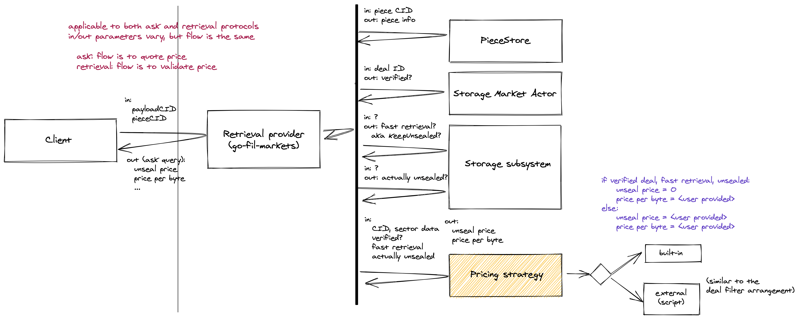

# Dynamic retrieval pricing in Lotus

Authors: @raulk

Initial PR: https://github.com/protocol/web3-dev-team/pull/97.

## Purpose &amp; impact 
#### Background &amp; intent
_Describe the desired state of the world after this project? Why does that matter?_

A retrieval client asks the miner for a quote before proceeding to retrieve a
piece or a part therein. The miner quotes:

- minimum price per byte
- maximum payment interval
- maximum payment interval increase
- unseal price

The quoted values become part of the deal proposal. Unlike with storage deals,
retrieval deal proposals don’t go on chain.	

All these values are filled from the “stored ask”. The “stored ask” can be
changed through JSON-RPC, but it’s statically set. Lotus doesn’t have the
ability to change the quote based on the piece that’s being requested.

This means that fast retrieval and non-fast retrieval deals get the same
treatment with regards to pricing. In other words, anything that’s set as the
"stored ask" will be a blanket policy for all retrievals, fast or ordinary,
verified or unverified.

Impact of the blanket policy to unsealing price:
- If the unsealing price is set to zero, the miner commits to serving all deals
  at zero cost, even those that require unsealing. Unsealing is a heavy and
  expensive operations, one that's irrational for miners to offer for free.
- If the unsealing price is set to non-zero, fast retrievals will require the
  creation of a payment channel, which introduces significant latency and
  requires chain interaction.

Impact of the blanket policy to price per byte:
- Miners wanting to provide free retrieval for verified deals would set this
  value to zero. This has the side-effect of skipping payment channel creation.
- However, that same policy would apply to unverified deals, which the miner is
  likely not keen to offer for free.

go-fil-markets doesn’t have access to the unseal status of a given piece,
so it’s unable to vary the quoted price accordingly.

#### Assumptions &amp; hypotheses
_What must be true for this project to matter?_

For incentivisation circuits not to break down midway, storage deals
performed with miner incentives (FIL+ datacap) must be retrievable under
preferential (e.g. free) terms.

To enable this, retrieval quoting should be dynamic, empowering miners to
configure custom policies based on the attributes of the original storage deal,
and other factors.

#### User workflow example
_How would a developer or user use this new capability?_

Miners should be able to configure a flexible built-in policy (which enables the
Bedrock golden path), as well as provide an external script that receives the
decision factors wrapped in a structured message, and returns the pricing
decisions. This could be similar to the existing deal filter mechanism.

#### Impact
_How would this directly contribute to web3 dev stack product-market fit?_

It's essential.

#### Internal leverage
_How much would nailing this project improve our knowledge and ability to execute future projects?_

Low. This is a chore, not a novelty seeking nor risky project.

#### Confidence
_How sure are we that this impact would be realized? Label from [this scale](https://medium.com/@nimay/inside-product-introduction-to-feature-priority-using-ice-impact-confidence-ease-and-gist-5180434e5b15)_.

10. This solves an existing shortcoming in our technology that we have "launch
data" for.

## Project definition

#### Brief plan of attack

1. Introduce the ability to query the unsealing status of a piece from the
   storage subsystem (unseal_status).
2. Introduce the ability to query whether the storage deal was a verified deal
   (verified_deal).
3. Introduce the ability to query whether the storage deal had fast retrieval
   enabled (fast_retrieval).
4. Add the ability to set a price function:
    - Built-in function (shipping with Lotus), which supports file
      configuration. By default, it prices verified, fast-retrieval, unsealed
      pieces at 0 (using the fields above).
    - Via an externally invoked function, so that miners can inject their own
      logic to quote dynamic prices -- similar to deal filter. This requires
      defining a schema and an intermediate data format (likely JSON).

#### What does done look like?
_What specific deliverables should completed to consider this project done?_

Merged pull requests on go-fil-markets and lotus + user documentation.

####  What does success look like?
_Success means impact. How will we know we did the right thing?_

If the goals in the project brief are satisfied, we know we did the right thing.

#### Counterpoints &amp; pre-mortem
_Why might this project be lower impact than expected? How could this project fail to complete, or fail to be successful?_

N/A.

#### Alternatives
_How might this project’s intent be realized in other ways (other than this project proposal)? What other potential solutions can address the same need?_

The pricing function could be hardcoded, but that's too short-sighted.

#### Dependencies/prerequisites
<!--List any other projects that are dependencies/prerequisites for this project that is being pitched.-->

F3 retrieval stabilisation.

#### Future opportunities

Introducing dynamic pricing enables miners to create more sophisticated pricing
models for retrieval deals.

## Required resources

#### Effort estimate

Small, 1-2 weeks.

#### Roles / skills needed

1 engineer.
